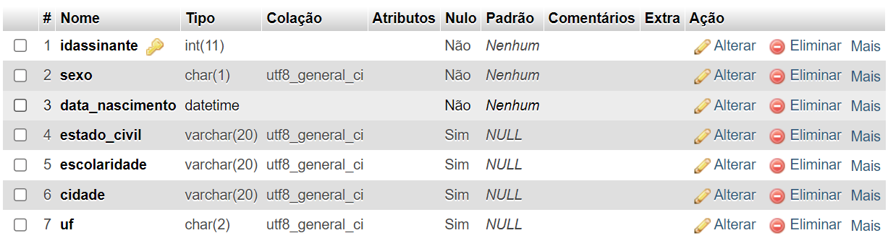
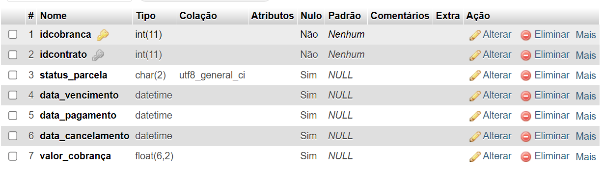
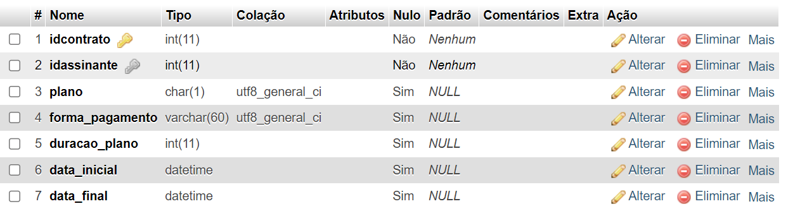
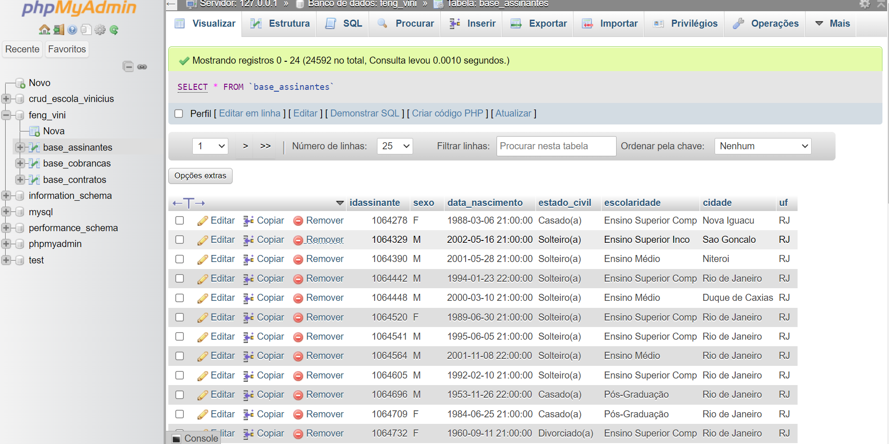
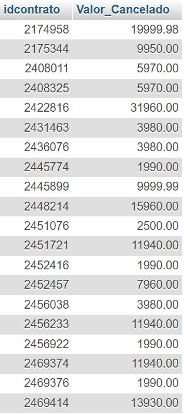
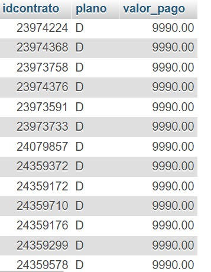
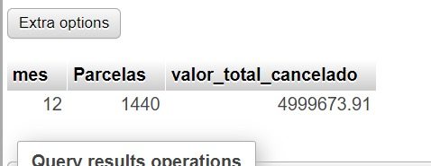

# Teste Feng Brasil *Vinicius de Miranda Barbosa*

### Sumário do teste

* Criação da tabela
* Resolvendo consultas
## Criando O banco de dados.
```sql
    CREATE DATABASE  feng_vini CHARACTER SET utf8mb4;
```

```sql


CREATE TABLE base_assinantes(
    idassinante INT NOT NULL PRIMARY KEY,
    sexo CHAR(1) NOT NULL,
    data_nascimento DATETIME NULL,
    estado_civil VARCHAR(20),
    escolaridade VARCHAR(20),
    cidade VARCHAR(20),
    uf CHAR(2)
)DEFAULT CHARSET=utf8;
```

```sql
CREATE TABLE base_contratos(
    idcontrato	INT NOT NULL PRIMARY KEY,
    plano CHAR(1), 
    forma_pagamento	VARCHAR(60), 
    duracao_plano	INT,
    data_inicial	DATETIME,
    data_final	DATETIME,
    idassinante	INT NOT NULL,
    CONSTRAINT fk_base_assinantes FOREIGN KEY (idassinante)  REFERENCES base_assinantes(idassinante)
 )DEFAULT CHARSET=utf8;
```

```sql
CREATE TABLE base_cobranças(
    idcobranca	INT NOT NULL PRIMARY KEY,
    status_parcela CHAR(2), 
    data_vencimento	DATETIME,
    data_pagamento	DATETIME,
    data_cancelamento DATETIME,
    valor_cobrança FLOAT(6,2),
    idcontrato	INT NOT NULL,
    CONSTRAINT fk_base_contratos FOREIGN KEY (idcontrato)  REFERENCES base_contratos(idcontrato)
 )DEFAULT CHARSET=utf8;
```


#### Formatação da tabela.


###### este comando está alterando a coluna data_nascimento na tabela base_assinantes, tornando-a do tipo "DATETIME" Foi usando para teste de tipo da tabela.
```sql

ALTER TABLE `base_assinantes` CHANGE `data_nascimento` `data_nascimento` DATETIME NULL DEFAULT CURRENT_TIMESTAMP;

```


===========================================================================

## consultas

### 1. Faça uma consulta que retorne o plano com maior ticket médio e o valor do ticket formatado para 2 casas decimais;

```sql
SELECT 
    bc.plano,
    ROUND(SUM(bcob.valor_cobrança) / COUNT(bc.idcontrato), 2) AS ticket_medio
FROM
    base_contratos bc
JOIN
    base_cobranças bcob ON bc.idcontrato = bcob.idcontrato
GROUP BY
    bc.plano
ORDER BY
    ticket_medio DESC
LIMIT 1;

```


### 2.	Faça uma consulta que retorne somente contratos que possuam parcela(s) cancelada(s) e o valor total dessa(s) parcela(s) canceladas e que não possuam nenhuma parcela paga ou em aberto;

```sql
SELECT
    bc.idcontrato,

    SUM(CASE WHEN bcob.status_parcela = 'CA' THEN bcob.valor_cobrança ELSE 0 END) AS Valor_Cancelado
FROM
    base_contratos bc
LEFT JOIN
    base_cobranças bcob ON bc.idcontrato = bcob.idcontrato
GROUP BY
    bc.idcontrato
HAVING
    SUM(CASE WHEN bcob.status_parcela = 'PA' THEN 1 ELSE 0 END) = 0
    AND SUM(CASE WHEN bcob.status_parcela = 'AB' THEN 1 ELSE 0 END) = 0
    AND SUM(CASE WHEN bcob.status_parcela = 'CA' THEN 1 ELSE 0 END) > 0;
```



### 3.	Faça uma consulta que retorne apenas o(s) contrato(s) com o segundo maior valor pago;

```sql
SELECT
    idcontrato,
    plano,
    valor_pago
FROM
    (SELECT
        bc.idcontrato,
        bc.plano,
        bcob.valor_cobrança AS valor_pago,
        DENSE_RANK() OVER (ORDER BY bcob.valor_cobrança DESC) AS ranking
    FROM
        base_contratos bc
    JOIN
        base_cobranças bcob ON bc.idcontrato = bcob.idcontrato
    WHERE
        bcob.status_parcela = 'PA') AS ranked_payments
WHERE
    ranking = 2;
```



### 4.	Faça uma consulta que retorne qual mês de 2022 teve mais parcelas canceladas e o valor total de cancelamento.

```sql
SELECT
    EXTRACT(MONTH FROM bcob.data_cancelamento) AS mes,
    COUNT(*) AS Parcelas,
    SUM(bcob.valor_cobrança) AS valor_total_cancelado
FROM
    base_cobranças bcob
WHERE
    EXTRACT(YEAR FROM bcob.data_cancelamento) = 2022
    AND bcob.status_parcela = 'CA'
GROUP BY
    mes
ORDER BY
    Parcelas DESC
LIMIT 1;

```


## Fim

### Obrigado pela oportunidade de participar do teste


